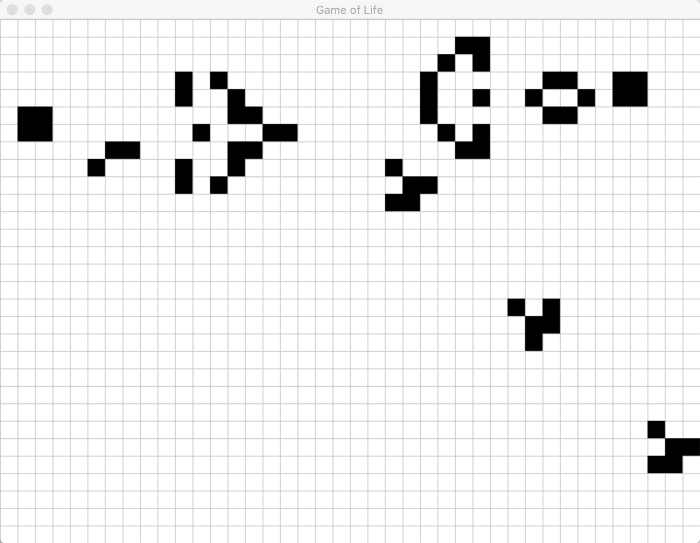

# Overview
A simple implementation of Conway's Game of Life in C++ using the SDL 2 graphics library.

# Requirements
* C++17+
* CMake 3.15+
* SDL 2

# Build

```shell script
cmake .
make
```

# Run

```shell script
./gameoflife canned/gosper-glider-gun.txt 5
```

# Screenshot

